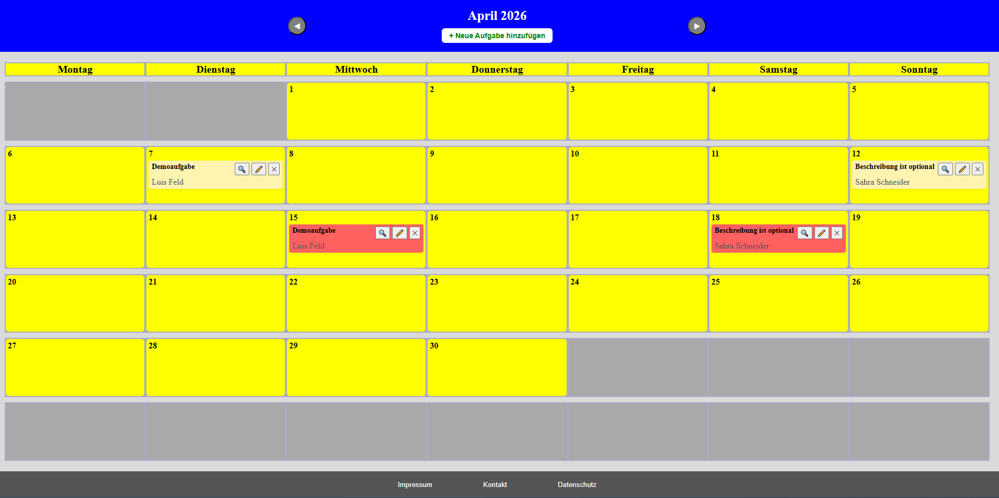
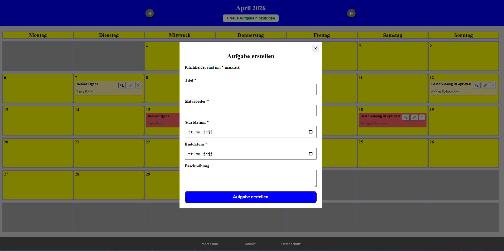
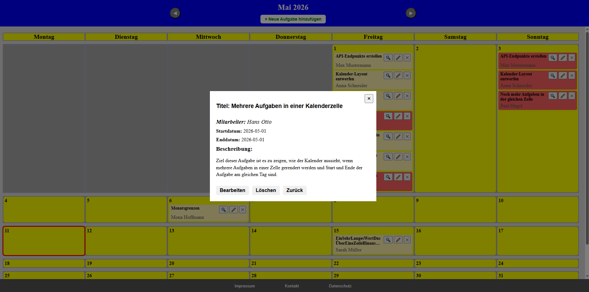

# Kalender-App (Full-Stack Vanilla JavaScript)

Eine webbasierte Full-Stack Kalenderanwendung zur Verwaltung von Aufgaben mit REST-API und dynamischer Kalenderansicht.

## Screenshots

### Kalenderansicht


### Aufgabe erstellen


### Detailansicht


## Features

- Dynamische Kalenderansicht
- Monatsnavigation 
- Vollständiges CRUD-System für Aufgaben
- Detailansicht für einzelne Aufgaben
- Wiederverwendbares Modal-System
- Toast Benachrichtigungen (Success, Error, Info)

## Tech-Stack

### Frontend

- HTML5
- CSS3
- Vanilla JavaScript (ES-Module)
- DOM-Manipulation ohne Frameworks

### Backend

- Node.js
- Express.js
- REST-API
- Serverseitige Validierung von Eingabedaten
- Schutz vor Race-Conditions durch serielle Write-Queue

### Datenspeicherung

- lokale JSON-Datei (keine Datenbank)

## Projektstruktur

Das Projekt ist modular aufgebaut und trennt zwischen Darstellung, Frontend-Logik und Backend.
```
public/
 ├── js/
 │    ├── api/                    # Kommunikation mit der REST-API
 │    ├── core/                   # Globaler State, DOM-Referenzen und
 │    │                           # Helper-Funktion zur DOM-Erstellung
 │    ├── features/
 │    │    ├── calendar/
 │    │    │    ├── calendar.view.js
 │    │    │    ├── calendar.events.js
 │    │    │    ├── calendar.logic.js
 │    │    │    └── calendar.css
 │    │    │
 │    │    ├── tasks/
 │    │    │    ├── tasks.view.js
 │    │    │    ├── tasks.events.js
 │    │    │    ├── tasks.logic.js
 │    │    │    ├── tasks.form.js
 │    │    │    ├── tasks.details.view.js
 │    │    │    ├── tasks.css
 │    │    │    ├── tasks.form.css
 │    │    │    └── tasks.details.view.css
 │    │    │
 │    │    ├── modal/
 │    │    ├── toast/
 │    │    └── footer/
 │    │
 │    ├── utils/
 │    └── index.js
 │
 ├── styles/
 └── index.html

server/
 ├── config/
 ├── routes/
 ├── utils/
 └── server.js
```

## Installation und Start

### Voraussetzungen
- Node.js (v24 oder höher)

### Projekt herunterladen
- git clone https://github.com/Rob2525252555/Kalender-App.git

### Installation
- cd Kalender-App
- npm install

### Entwicklungsmodus
- npm run dev

### Produktionsmodus
- npm start

### Anwendung öffnen
- http://localhost:8080

## Architektur & Technische Highlights

- Modulare Frontend-Architektur mit ES-Module
- Feature-basierte Ordnerstruktur
- Zentrales State-Management und zentrale Verwaltung von DOM-Referenzen
- Wiederverwendbares Modal-System
- Toasts für Benachrichtigungen für Feedback (Success, Error, Info)
- Event Delegation für dynamisch erzeugte Buttons
- REST-API mit Express.js
- Schutz vor Race Conditions durch serielle Schreiboperationen
- Validierung von JSON-Daten beim Serverstart
- Sicherstellen, dass data-Ordner und die JSON-Datei für Datenspeicherung existieren

## Mögliche Erweiterungen
- Uhrzeit für Aufgaben hinzufügen (statt nur Datum)
- Aufgaben als „abgeschlossen“ markieren
- Abgeschlossene oder abgelaufene Aufgaben in eigenen Bereich verschieben
- Zusätzliche Listenansicht neben der Kalenderansicht
- Filter- und Suchfunktion für Aufgaben
- Wiederkehrende (z. B. wöchentliche) Aufgaben
- Datenbank verwenden zum Speichern der Aufgaben
- Benutzer-Authentifizierung (Login-System)
